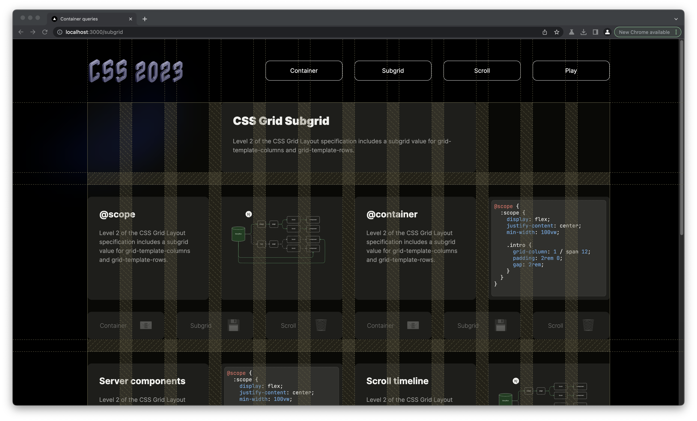

# WARNING! This is a concept project developed specifically for Chrome Canary!

Please download Chrome Canary to continue

https://www.google.com/intl/en_uk/chrome/canary

## Then enable the following flags

`chrome://flags/#enable-experimental-web-platform-features`

`chrome://flags/#view-transition`

`chrome://flags/#view-transition-on-navigation`

# Canary Components

This project pulls together several new and experimental technologies into a single 'concept' build. The goal is to use a combination of raw HTML/CSS & TypeScript to build out a component based application.

<h1 align="center">
	
</h1>
